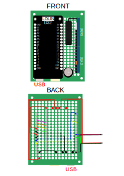
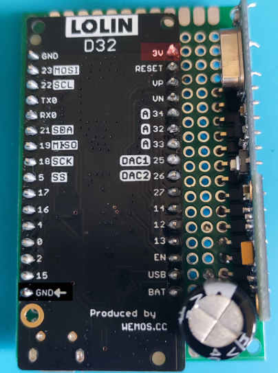
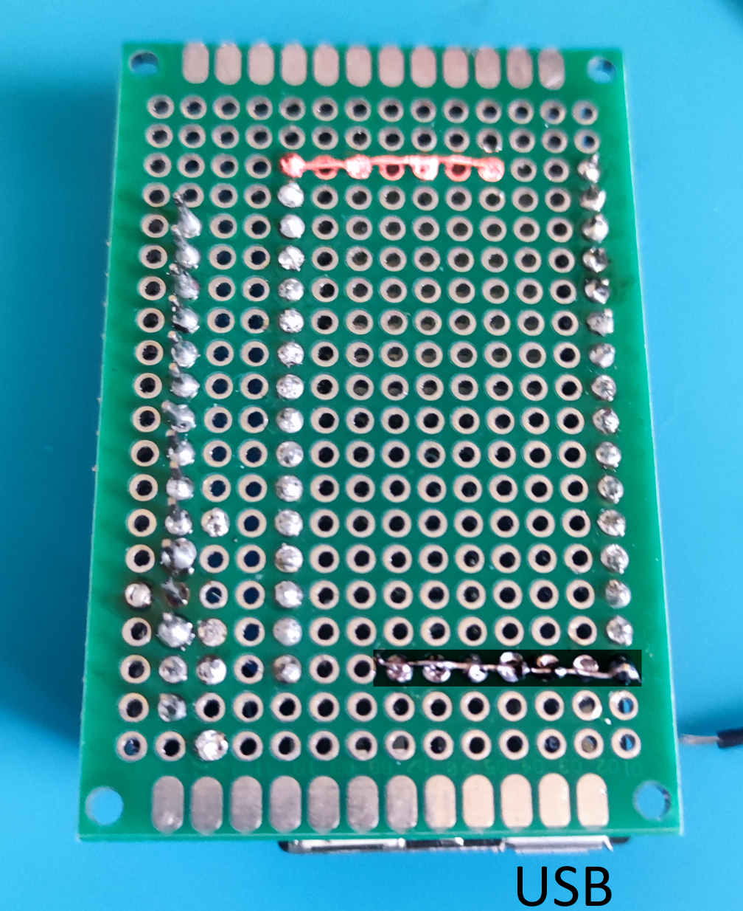
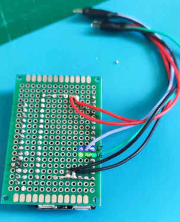
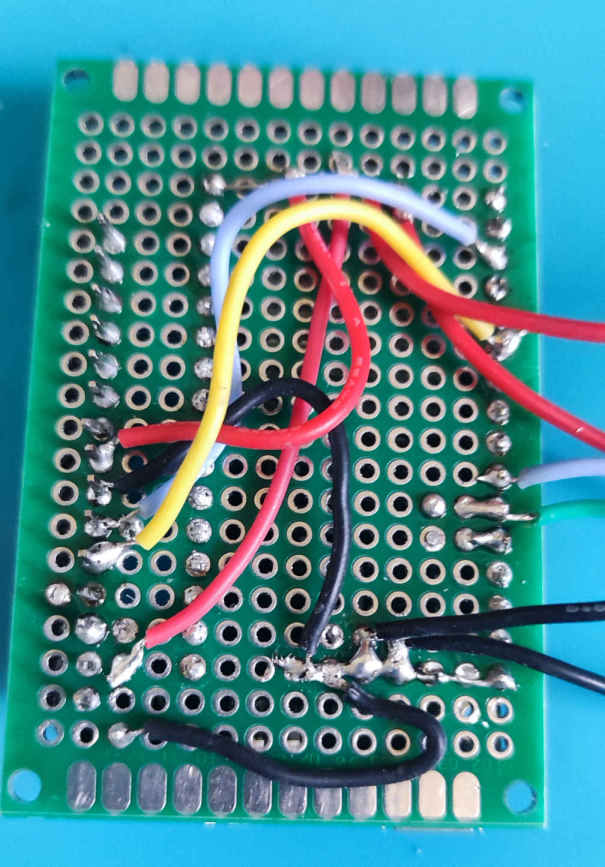
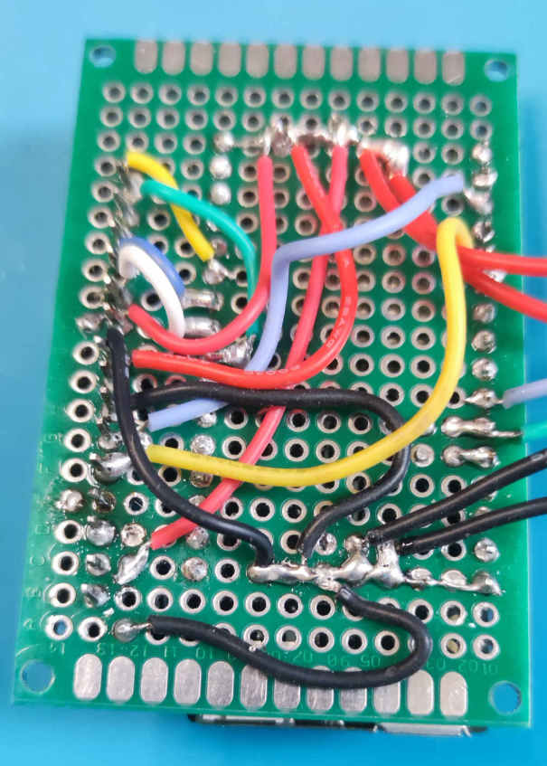
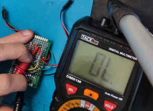

# Schéma Soudure Harnais

# Composants
* [Lolin D32](https://www.aliexpress.com/item/32808551116.html)
* Condensateur 1000µF
* Gyroscope / Accéléromètre MPU6050
* [Récepteur Radio GERMA](https://fr.aliexpress.com/item/4000380603041.html)

# Montage

## Positionnement des composants
Faites attention à bien positionner le lolin D32, en prenant comme repère le port USB.   

## Faire un pont de soudure
Nous allons avoir besoin de relier plusieurs + (VCC) et - (GND) pour alimenter les différents composants.   

Pour cela nous allons faire un pont de soudure à l'aide d'un câble dénudé

https://user-images.githubusercontent.com/2841495/168049113-339e2527-cfae-4e33-aa5a-d6395ec7d343.mov

## Soudure du VCC et GND
Retourner la carte et souder les composants en place.    

Positionnez la carte par rapport au port USB.

## Câblage des 2 strips de LEDS

## Câblage du MPU6050 / Condensateur

## Câblage du Récepteur Radio

## Vérification
A l'aide d'un multimètre vérifiez au minimum que les câbles rouge et noir ne sont pas en contact avant de brancher le lolin d32 en USB.

